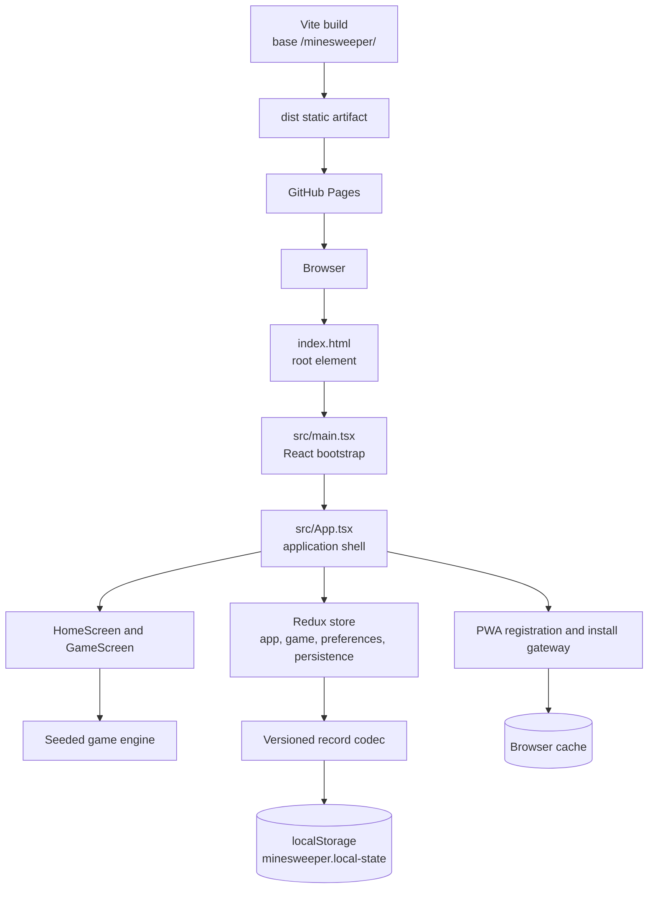
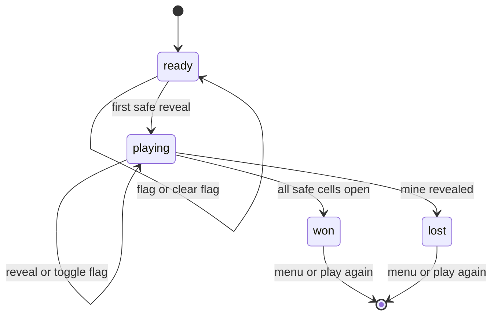

# Architecture

## Runtime boundary

The application is a browser-only static SPA. Vite emits HTML, JavaScript, CSS, fonts, icons, the manifest, and a generated service worker into `dist`. GitHub Pages serves those files below `/minesweeper/`; the browser owns execution, state, storage, and optional installation.



The application has no server-side request/response flow. Browser input enters through React event handlers and exits as DOM updates, local browser writes, service-worker cache activity, or optional browser installation/update actions.

## Bootstrap and runtime boundary

1. `index.html#root` supplies the DOM mount point and relative manifest link.
2. `src/main.tsx#main` initializes the install gateway, creates the Redux provider, and renders `App`.
3. `src/App.tsx#App` hydrates the store from `StorageGateway`, registers the service worker when online, applies the appearance and locale, starts the timer loop, and binds `visibilitychange` and `pagehide` lifecycle handling.
4. The application route in `appSlice.ts` selects `HomeScreen` or `GameScreen`; blocking sheets and notices are rendered alongside the active screen.

`App` receives an optional `StorageGateway` for deterministic lifecycle tests. Production construction uses `createStorageGateway()` and the browser's `localStorage` when available.

## Game domain

The domain layer in `src/domain/` does not import React, Redux, browser APIs, or persistence modules.

- `config.ts#validateConfig` accepts the three fixed presets and validates Custom boards from 5–30 rows, 5–30 columns, and 1 through cells minus 1 mines.
- `prng.ts#createSeededRandom` and `sampleUnique` produce deterministic mine placement from a stored unsigned seed.
- `gameEngine.ts#createGame` creates an unplaced board in `ready` state.
- `gameEngine.ts#applyCommand` ignores invalid, revealed, and terminal actions; toggles flags; clears a flag when a reveal targets a flagged cell; and delegates opening to the reveal algorithm.
- Mines are placed only when the first genuinely unopened, unflagged cell is revealed, excluding that cell from mine candidates.
- `gameEngine.ts#reveal` uses an iterative queue for zero-cell flood fill and bordering numbered cells.
- Revealing a mine transitions to `lost` and exposes mine presentation states. Opening every safe cell transitions to `won` and flags remaining mines.



## Client state

`src/app/store.ts#createAppStore` combines four Redux slices:

| Slice | Responsibility |
|---|---|
| `app` | Home/Game route, blocking sheet, document visibility, and notices. |
| `game` | Current `GameSession`, injected-clock timestamps, resumability, and lifecycle actions. |
| `preferences` | Locale, appearance, input mode, and selected configuration. |
| `persistence` | Hydration status, persistence errors, reset status, and standard/Custom records. |

The timer uses `gameClock.ts#startClock` at a 250 ms interval but only dispatches ticks when `clockEligible` is true. Elapsed time is accrued from injected timestamps and pauses on Home, hidden documents, `pagehide`, blocking sheets, and terminal states. Displayed and recorded seconds use `ceil(elapsedMs / 1000)`.

## Presentation and interaction

- `HomeScreen.tsx#HomeScreen` owns difficulty selection, Custom input validation, starting/replacing/resuming games, and the optional install action.
- `GameScreen.tsx#GameScreen` owns route controls, reset/replay/outcome behavior, record completion, and board command dispatch.
- `Board.tsx#Board` maps cells to a scrollable grid and routes pointer, context-menu, touch, and keyboard actions to typed `GameCommand` values.
- `boardInteraction.ts#createPointerSession` implements the 600 ms touch long-press; movement of 10 CSS pixels or more cancels it so board scrolling does not invoke the secondary action.
- `BoardKeyboardController.ts#BoardKeyboardController` moves focus with Arrow keys and performs primary/secondary actions with Enter, Space, and F. The board focuses cell zero when a new or resumed session opens and scrolls only its own viewport to keep focus visible.
- `ModalSheet.tsx#ModalSheet` provides dialog semantics, Escape handling, focus restoration, and focus trapping for Help, Settings, confirmation, and outcome sheets.
- `tokens.css` defines semantic light/dark variables. `themeController.ts#applyTheme` resolves `light`, `dark`, or `system` and observes the system media query only for the System choice.
- `catalog.ts` contains parallel English and Ukrainian message keys. `translate.ts#translate` performs typed lookup and interpolation; visible locale changes update open sheets through Redux state.

Board cells remain at or above the configured touch-size floor and oversized boards scroll inside `BoardViewport`; the page itself does not become the board scroll container.

## Persistence data flow

`persistenceController.ts#hydrateStore` reads through a `StorageGateway`, decodes and validates `PlayerRecordV1`, configurations, records, cells, and resumable session invariants, then hydrates Redux. Missing data uses defaults. Malformed, future, invalid, or unavailable data uses safe defaults and adds a localized notice.

`persistenceController.ts#recordFromState` writes only preferences, records, and a `ready`/`playing` resumable session. Completed sessions are not retained for reload. A storage write or clear failure keeps the live game usable and adds a localized non-blocking warning; existing data is not deleted as a recovery strategy.

The record contract is versioned:

```text
minesweeper.local-state -> PlayerRecordV1
  version: 1
  preferences: locale, appearance, inputMode, selectedConfig
  standardRecords: beginner/intermediate/expert best times
  customRecords: canonical rowsxcolumns:mines keys, maximum 100
  resumableGame: optional ready or playing GameSession
```

Custom record recency is updated when a Custom game starts. When the 100-entry limit is exceeded, the least recently started Custom configuration is removed.

## PWA and static artifact

`vite.config.ts#default` sets `base: '/minesweeper/'` and configures `vite-plugin-pwa` with prompt registration, a navigation fallback, and local static asset patterns. `public/manifest.webmanifest` defines the app ID, start URL, scope, standalone display mode, and repository-subpath icon URLs.

`registerPwa.ts#registerPwa` registers the worker only in a browser that is online, reports a waiting update through the notice system, and marks the PWA ready only after an active worker is observed. `approvePwaUpdate` flushes persistence, activates the waiting worker, and reloads only after the player chooses Update.

`installGateway.ts#initializeInstallGateway` listens for `beforeinstallprompt` and `appinstalled`. The install control is progressive enhancement: unsupported browsers simply do not expose an install action; Android browsers without a prompt can receive manual-install instructions.

## External services and outputs

There are no upstream or downstream services. The only browser-managed integrations are:

| Resource | Type | Purpose | Failure behavior |
|---|---|---|---|
| Browser DOM/events | Synchronous browser API | Render screens and receive input/lifecycle events. | React remains usable within browser support. |
| `localStorage` | Synchronous local storage | Retain preferences, records, and active games. | Safe defaults and localized non-blocking notice. |
| Service worker/cache | Browser-managed PWA resource | Cache local artifact and handle updates. | App remains usable when registration/install is unavailable; update is not activated automatically. |
| Browser install prompt | Optional browser event | Offer installation where supported. | No install action or manual guidance depending on platform. |

No runtime network fetch is required for gameplay. The bundled Inter and Press Start 2P fonts are local assets; their licenses and sources are documented in `src/assets/fonts/README.md`.
