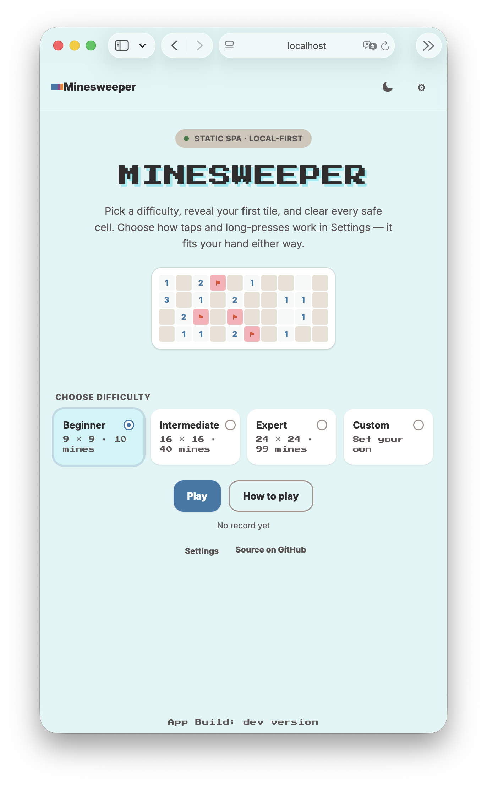
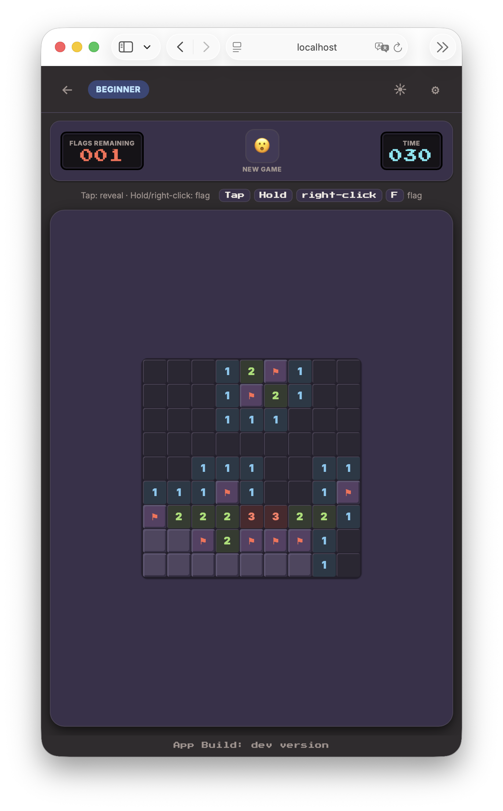

# Minesweeper static SPA

> Minesweeper is a bilingual browser game that builds to static assets, runs without a backend, and stores player data in the local browser.

## 1. Identity

| Field | Value |
|---|---|
| Service name | Minesweeper static SPA |
| Service ID | `minesweeper-static-spa` |
| Domain | Browser game |
| Purpose | Provide a playable Minesweeper game as a static Vite SPA/PWA. |
| Languages | English and Ukrainian. |
| Owner | TODO: confirm; repository metadata identifies `sanyokkua/minesweeper` and does not declare a team. |
| Runtime | Browser; no application server. |
| Deployment | GitHub Pages artifact under `/minesweeper/`. |
| Repository | [sanyokkua/minesweeper](https://github.com/sanyokkua/minesweeper) |

## 2. Documentation map

- [`architecture.md`](architecture.md) — runtime boundaries, game flows, state, persistence, localization, theme, and PWA behavior.
- [`development.md`](development.md) — environment preparation, dependencies, commands, tests, source layout, and SpecKit workflow.
- [`operations.md`](operations.md) — CI, Pages deployment, artifact validation, service-worker lifecycle, and troubleshooting.
- [`../README.md`](../README.md) — short repository entry point with the two application screens.

## 3. Authority hierarchy

When documents disagree, use the following order:

1. Current source, configuration, tests, and `.github/workflows/` files describe implemented behavior and delivery.
2. [`.specify/memory/constitution.md`](../.specify/memory/constitution.md) defines repository-wide constraints.
3. [`specs/001-minesweeper-spa/spec.md`](../specs/001-minesweeper-spa/spec.md), [`ui-contract.md`](../specs/001-minesweeper-spa/ui-contract.md), `plan.md`, contracts, and task evidence define current feature intent and acceptance contracts.
4. [`minesweeper-mockup-v2.html`](minesweeper-mockup-v2.html) is a visual reference; it is not production code.
5. [`minesweeper-web-spec.md`](minesweeper-web-spec.md) is historical input and contains superseded framework assumptions.

Tests provide executable evidence for the behavior they cover. A green test does not replace the product specification, visual contract, artifact checks, or browser release evidence.

## 4. Application screens

### Home

`src/ui/screens/HomeScreen.tsx#HomeScreen` renders the title, appearance and settings controls, a board preview, Beginner/Intermediate/Expert/Custom choices, Custom fields when selected, Play/New game/Resume actions, Help, records, optional installation, and the repository link.

### Game

`src/ui/screens/GameScreen.tsx#GameScreen` renders the back control, current configuration, appearance and settings controls, flags counter, reset/status control, timer, input hint, board, and win/loss outcome actions.

Help, settings, reset, replacement, local-data, and outcome dialogs are composed by `src/ui/components/AppSheets.tsx#AppSheets` and implemented with the reusable modal components.

## 5. Inputs and entry points

This project has no REST, RPC, queue, cron, webhook, or CLI entry point.

| Input | Source | Meaning |
|---|---|---|
| Browser document | `index.html#root` and `src/main.tsx#main` | Loads the React application into the root element. |
| Pointer events | `src/ui/components/Board.tsx#Board` | Reveal or secondary board action from click, right-click, or touch. |
| Keyboard events | `src/ui/components/BoardKeyboardController.ts#BoardKeyboardController` | Move board focus with Arrow keys and act with Enter, Space, or F. |
| Browser lifecycle | `src/App.tsx#App` | Pause/resume and persist on route changes, visibility changes, and `pagehide`. |
| Browser installation/update events | `src/pwa/installGateway.ts#initializeInstallGateway`, `src/pwa/registerPwa.ts#registerPwa` | Capture optional install prompts and service-worker updates. |

Authentication and authorization are not applicable. The app is a client-side game with no user account boundary.

## 6. Outputs and exit points

| Output | Target | Conditions |
|---|---|---|
| Rendered application state | Browser DOM | On every Redux state change affecting the active route or overlay. |
| Player record | `localStorage` key `minesweeper.local-state` | After hydration and relevant preference/game/record/lifecycle changes. |
| Cached static resources | Browser service-worker cache | When the VitePWA-generated worker installs and precaches the built artifact. |
| Install prompt | Browser installation UI | Only when the browser emits `beforeinstallprompt` and the PWA is not already installed. |
| Update notice/reload | Browser service worker and page | Only after a waiting worker is found and the player chooses Update; state is flushed first. |
| Static deployment artifact | GitHub Pages `dist` upload | On the Pages workflow for the configured release branch. |

There are no downstream APIs, databases, message brokers, or external runtime services.

## 7. Main business flows

1. `HomeScreen#start` selects a valid configuration, confirms replacement when an active game exists, creates a seeded session, updates record recency, persists, and navigates to Game.
2. `GameScreen#GameScreen` dispatches board commands through `features/game/gameSlice.ts#command` to `domain/gameEngine.ts#applyCommand`.
3. `gameEngine.ts#applyCommand` validates coordinates and terminal state, toggles flags, places mines after the first genuinely opened cell, performs iterative flood fill, and transitions to win or loss.
4. `App#App` starts the timer only while a playing game is on the Game route, the document is visible, and no blocking sheet is open.
5. `persistenceController.ts#hydrateStore` decodes and validates the versioned local record; malformed, future, invalid, or unavailable data falls back to safe defaults and produces a localized notice.
6. `registerPwa.ts#approvePwaUpdate` persists before service-worker activation and reloads only after explicit player approval.

Detailed flows and state transitions are in [`architecture.md`](architecture.md).

## 8. Data and configuration summary

- Game domain data is defined by `GameConfig`, `GameSession`, `Cell`, `GameCommand`, and `CellPresentation` in [`src/domain/gameTypes.ts`](../src/domain/gameTypes.ts).
- The persisted schema is `PlayerRecordV1` in [`src/features/persistence/recordCodec.ts`](../src/features/persistence/recordCodec.ts), version `1`, under `minesweeper.local-state`.
- Presets are Beginner `9×9/10`, Intermediate `16×16/40`, and Expert `24×24/99`. Custom boards allow 5–30 rows, 5–30 columns, and 1 through cells minus 1 mines.
- Appearance is `light`, `dark`, or `system`; input mode is `reveal-first` or `flag-first`; locale is `en` or `uk`.
- `vite.config.ts#default` hard-codes `base: '/minesweeper/'` and maps the `BUILD_TIMESTAMP` environment key to the compile-time `__APP_BUILD_TIMESTAMP__` value used by `BuildStamp`.
- No secrets or runtime service credentials are used.

## 9. Coverage map

| Repository area | Documented in |
|---|---|
| `src/main.tsx`, `index.html` | [`architecture.md`](architecture.md#bootstrap-and-runtime-boundary) |
| `src/domain/` | [`architecture.md`](architecture.md#game-domain) |
| `src/app/`, `src/features/` | [`architecture.md`](architecture.md#client-state) |
| `src/i18n/`, `src/ui/` | [`architecture.md`](architecture.md#presentation-and-interaction) |
| `src/pwa/`, `public/`, `vite.config.ts` | [`architecture.md`](architecture.md#pwa-and-static-artifact) and [`operations.md`](operations.md#build-configuration) |
| `scripts/`, `tests/`, `vitest.config.ts`, `playwright.config.ts` | [`development.md`](development.md#tests-and-validation) |
| `package.json`, `package-lock.json`, TypeScript/ESLint/Prettier config | [`development.md`](development.md#dependencies-and-tooling) |
| `.github/workflows/` | [`operations.md`](operations.md#continuous-integration-and-pages) |
| `.specify/`, `specs/`, `.agents/skills/`, `AGENTS.md` | [`development.md`](development.md#spec-driven-changes-and-agent-guidance) |
| `docs/`, `README.md`, `LICENSE` | This documentation map, [`README.md`](../README.md), and [`operations.md`](operations.md#license-and-assets) |

## 10. Known documentation gaps

- `TODO: confirm` the repository owner/team name.
